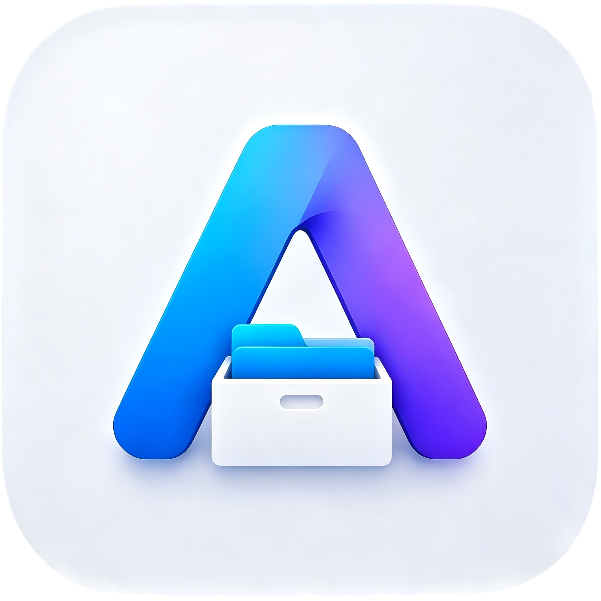

<p align="center">
  
</p>

<h1 align="center">ArcBox File Manager</h1>

<p align="center">
  <strong>Gerenciador de Arquivos Moderno, Seguro e com Atualizações Automáticas via GitHub Releases para Android</strong>
</p>

<p align="center">
  <a href="releases"></a>
  
  
  
  
</p>

---

## 🚀 Novidades da Versão v1.0.8

- ☁️ **Correção Completa do Download MEGA Cloud**:
  - Resolução robusta de handles e diretórios remotos (`findHandleFromPath`) com suporte a nós com URLs codificadas e identificadores diretos.
  - Extração e descriptografia direta de chaves AES-CTR a partir da carga útil do MEGA quando não disponíveis no cache de nós.
  - Gravação segura e atômica com fallback automático de stream para arquivos temporários e limpeza garantida.
  - Nova tentativa automática e revalidação de sessão (`fetchNodes`) caso o link de download expire ou responda com erro temporário.
- 🎨 **Splash Screen e Ícone do App Ampliados**:
  - Nova Splash Screen customizada com `@drawable/splash_icon_large` em alta resolução (160dp) para Android 12+ (`values-v31/themes.xml`) e fundo harmônico `#0B132B`.
  - Ícone adaptativo de primeiro plano ajustado de 64dp para 96dp (`ic_launcher_foreground.xml`), garantindo nitidez e visibilidade ideal na tela inicial.
- 🛠️ **Estabilidade & Sincronização**:
  - Aprimoramentos no fluxo de download e exportação de itens de armazenamento em nuvem para a pasta de Downloads local.

---

## 📋 Histórico de Versões

### v1.0.7
- 🎛️ **Botão Liga/Desliga para Transições**: Interruptor moderno (*Switch*) no cabeçalho do cartão "Transição entre Pastas" nas Configurações.
- ⏱️ **Tempo de Transição Calibrado**: Duração aumentada (340ms a 400ms) com curvas *Emphasized Decelerate* e *FastOutSlowInEasing*.
- 🚀 **Rolagem Rápida a 120Hz**: Algoritmo com fading suave e congelamento temporário de thumbnails durante fling rápido.

---

## 🚀 Sobre o ArcBox

O **ArcBox** é um gerenciador de arquivos nativo para Android desenvolvido com foco em desempenho extremo, fluidez a 120Hz, privacidade, design Material 3 e independência da Google Play Store através de um sistema nativo de auto-atualização conectado diretamente às **GitHub Releases**.

---

## ✨ Principais Funcionalidades

- 📁 **Navegação Ultrarrápida de Arquivos**: Gerenciamento de arquivos e pastas internos, cartão SD, OTG e partições de sistema com Root com rolagem ultra suave (zero recomposição) e transições contextuais aceleradas por hardware.
- ⚡ **Auto-Update via GitHub Releases**:
  - Consulta automática e silenciosa da versão mais recente via API oficial do GitHub.
  - Download em background com barra de progresso e cancelamento.
  - Verificação de integridade via **SHA-256** e checagem de assinatura de pacote (`PackageManager`).
  - Suporte a atualizações opcionais e **atualizações obrigatórias** (`[MANDATORY]`).
  - Alternadores nas Configurações: *Atualizações Automáticas*, *Download Apenas no Wi-Fi* e *Servidor Customizado*.
- 🔒 **Cofre Seguro com Biometria**: Proteja arquivos sensíveis com criptografia e autenticação biométrica (Impressão digital / Face).
- ☁️ **Integração com Nuvens & Armazenamento Remoto**:
  - Google Drive, MEGA, Dropbox, OneDrive, MediaFire e WebDAV (Nextcloud / OwnCloud).
- 📦 **Compactador e Descompactador**: Suporte nativo a arquivos `.zip`, `.tar`, `.gz` com pré-visualização de conteúdo.
- 🎨 **Personalização Material Design 3**:
  - Tema Claro, Escuro e Dinâmico (Monet).
  - Cores de destaque customizáveis (Violeta, Esmeralda, Oceano, Rubi, Âmbar).
  - Transições fluidas e dinâmicas de pastas com curvas M3 e profundidade de navegação (Slide, Fade, Zoom, Efeito Pilha).
  - Barra de rolagem rápida suave com fading automático.
- 🗑️ **Lixeira Inteligente**: Recuperação rápida de arquivos excluídos com limpeza automática configurável.
- 📊 **Dashboard de Armazenamento**: Gráficos visuais de ocupação por tipo de mídia (Vídeos, Imagens, Áudios, Documentos, APKs).

---

## 🛠️ Tecnologias e Arquitetura

- **Linguagem**: Kotlin 100%
- **Interface**: Jetpack Compose com Material Design 3 (M3)
- **Arquitetura**: MVVM (Model-View-ViewModel) com Coroutines e `StateFlow`
- **Persistência**: Room Database & Android SharedPreferences
- **Rede & Atualizações**: HttpsURLConnection com TLS Seguro & API GitHub v3
- **Compatibilidade**: Android 10 (API 24+) até Android 16 (API 36)

---

## 📥 Como Baixar e Instalar

1. Baixe o APK oficial mais recente na aba de [**Releases**](releases).
2. Abra o arquivo `.apk` no seu dispositivo Android.
3. Se solicitado, autorize a permissão de *"Instalar apps desconhecidos"* para o seu navegador ou gerenciador.
4. Conclua a instalação. O ArcBox continuará se atualizando automaticamente a partir desta versão!

---

## ⚙️ Como Publicar uma Nova Versão (Guia do Desenvolvedor)

### 1. Atualize a versão no `build.gradle.kts`:
```kotlin
defaultConfig {
    versionCode = 2
    versionName = "1.1.0"
}
```

### 2. Gere o APK assinado ou de release:
```bash
gradle assembleRelease
```
O APK será gerado em: `app/build/outputs/apk/release/app-release.apk` (ou `assembleDebug`).

### 3. Crie a Release no GitHub:
1. No seu repositório GitHub, acesse a aba **Releases** e clique em **"Draft a new release"** (ou **"Create a new release"**).
2. Escolha uma tag no formato `v1.0.0` (ou `v1.1.0`).
3. Dê um título para a release (ex: `ArcBox v1.0.0 - Lançamento Oficial`).
4. Escreva as novidades no Changelog. *(Para atualização obrigatória, inclua `[MANDATORY]` no texto)*.
5. Anexe o arquivo `.apk`.
6. Clique em **"Publish release"**.

O ArcBox em todos os dispositivos instalados detectará a nova versão automaticamente!

---

## 🔒 Segurança e Privacidade

- O ArcBox **não coleta telemetria pessoal**.
- Toda a comunicação de atualizações é feita diretamente entre o dispositivo do usuário e os servidores HTTPS oficiais do GitHub (`api.github.com` e `objects.githubusercontent.com`).
- A integridade do instalador é checada antes de abrir o instalador de pacotes do sistema.

---

## 📄 Licença

Distribuído sob a licença MIT.
